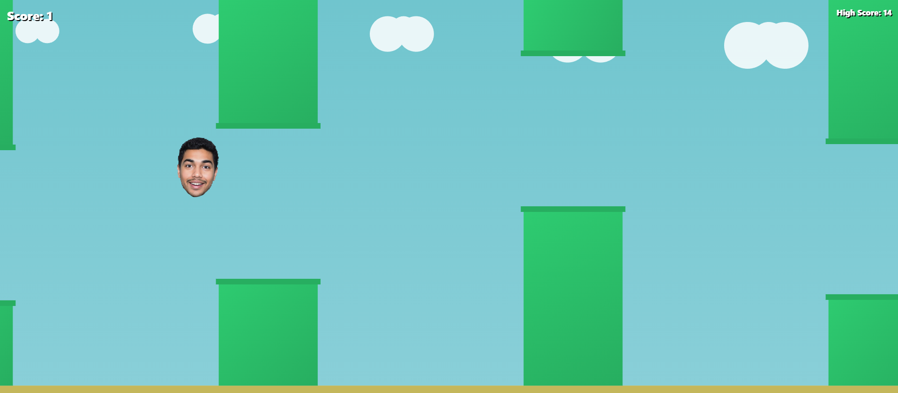

# 🐦  Flappy Game

Flappy Game-Bird style game made using **pure HTML, CSS & JavaScript**.

No frameworks. No installation. Just open and play.

---

## 🖼 


---

## 📱 Screenshots

### Desktop Version


### Mobile Version  


---

## 🎮 How to Play

1. Open **`index.html`** in any browser  
2. Tap / Click / Press **Space / ↑** to flap  
3. Dodge pipes → Score points → Beat high-score

---

## 📁 Repository Structure

```
📦 Flappy Game-bird
├── index.html
├── bird.png
├── background-music.mp3
└──crash-sound.mp3

```

---

## ✨ Features

- Smooth physics + gravity
- Keyboard + mouse + touch support
- Background music + SFX
- Saves high score in browser
- Fully responsive, works on mobile & desktop
- Lightweight — runs offline

---

## 🔥 Run Locally

Just open:

```bash
index.html
```

No dependencies. No setup. No internet required.

---

Made by **Ratnadeep Bose**
